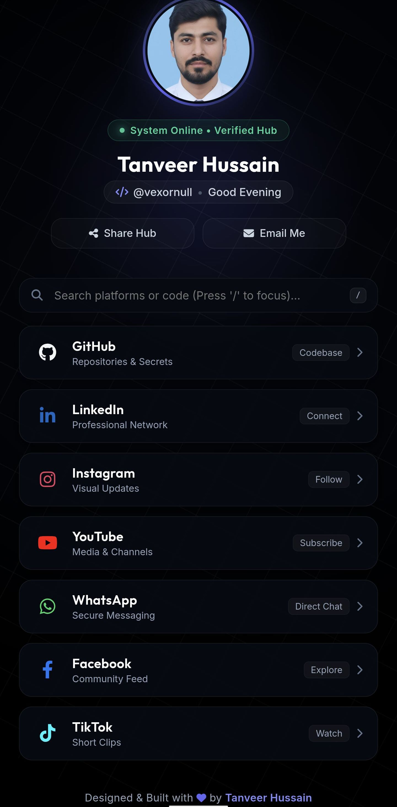

# ⚡ TANVEER HUSSAIN — CYBER SOCIAL HUB & PORTFOLIO
### *Next-Gen Holographic Glass-Morphism & 90fps Momentum Dashboard*

---

## 📸 Demo Preview

  

---

## 🌟 Overview

**Cyber Social Hub** is a lightning-fast, highly optimized, and visually stunning personal web application designed for developer `@vexornull`. Built without heavy frontend frameworks to ensure zero bloat and instant load times, it combines futuristic cyber aesthetics with high-performance physics-based motion engines and real-time telemetry.

👉 **Live Access:** [vexornull-social-media-profiles.vercel.app](https://vexornull-social-media-profiles.vercel.app)

---

## 💎 Elite Core Features

* **🪐 90fps Momentum Grid Engine:** Powered by a custom requestAnimationFrame loop utilizing exponential decay interpolation (spring physics) to transition from an intense 3-second startup spin into a buttery-smooth slow-motion drift.
* **🔦 Interactive Cursor Spotlight:** A dynamic radial gradient tracking the user's mouse coordinates to cast real-time depth lighting across glass-morphic surfaces.
* **📊 Live Telemetry Hub:** Renders a real-time system clock, dynamic infrastructure ping simulator, and an instant matrix background toggle switch.
* **🔍 Instant Platform Filtering:** Real-time search engine allowing visitors to instantly filter out social handles and developer channels. Includes keyboard shortcut support (`Press '/' to focus`).
* **🥚 Chill "Bro-Vibe" Easter Egg:** Clicking the profile avatar cycles through chill, developer-friendly statuses like `"Bro, chill! You're gonna break the screen."`, `"Easy there, man. I'm not an ATM."`, and `"Relax, bro. Admiring the profile is enough!"` instead of standard boring text.
* **📋 Smart Clipboard Copy:** One-click username/link copying with instant visual toast notifications for effortless sharing.
* **📱 Fluid & Adaptive UI:** Fully responsive design engineered with fluid CSS clamps and mobile-optimized touch feedback.

---

## 🛠️ Technology Stack

* **Core Markup:** HTML5 (Strict Semantic Tags & Schema.org JSON-LD Structured Data)
* **Styling Architecture:** Modern CSS3, CSS Custom Properties (Variables), Flexbox, Backdrop Filters, Glass-morphism
* **Scripting Engine:** Vanilla JavaScript (ES6+, DOM Manipulation, RequestAnimationFrame Physics)
* **Assets & Typography:** FontAwesome 6, Google Fonts (*Outfit*, *Inter*, *JetBrains Mono*)
* **Deployment & CI/CD:** Vercel Cloud Platform

---

## 📂 Project Structure

vexornull-social-media-profiles/
├── assets/
│   └── demo.png     # Application preview screenshot
├── index.html       # Primary entry point, meta tags, and structured data schema
├── style.css        # Cyber theme styling, keyframes, and glass-morphism tokens
└── script.js        # Momentum grid loop, spotlight listener, telemetry clock, search filters, and avatar easter eggs

---

## 🚀 Local Installation & Setup

If you want to clone and run or test this project locally on your machine, follow these simple steps:

1. **Clone the Repository:** 
   `git clone https://github.com/vexornull/vexornull-social-media-profiles.git`

2. **Navigate to Project Directory:** 
   `cd vexornull-social-media-profiles`

3. **Run Locally:** 
   Open `index.html` directly in your browser, or spin up a local development server using VS Code Live Server.

---

## 🌐 Official Channels & Developer Network

* **GitHub:** [@vexornull](https://github.com/vexornull)
* **LinkedIn:** [Tanveer Hussain](https://linkedin.com/in/vexornull)
* **Instagram:** [@vexornull](https://instagram.com/vexornull)
* **YouTube:** [@vexornull](https://youtube.com/@vexornull)
* **WhatsApp:** [Direct Secure Chat](https://wa.me/+923229522470)
* **Facebook:** [Tanveer Hussain](https://facebook.com/vexornull)
* **TikTok:** [@vexornull](https://tiktok.com/@vexornull)

---

  
Designed, Engineered & Deployed with 💜 by <b>Tanveer Hussain (@vexornull)</b>

